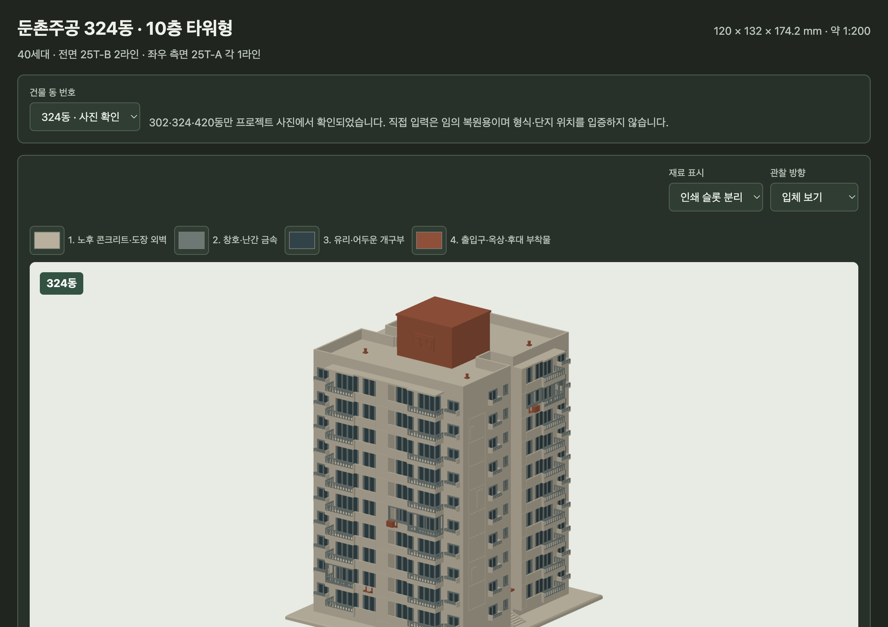
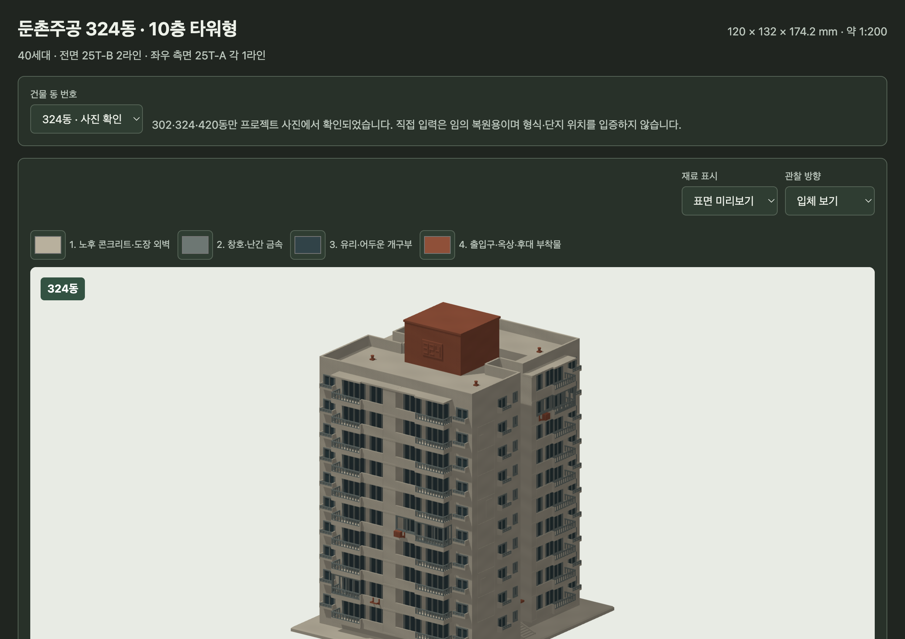

# 둔촌주공 4색 3D 인쇄 재료 구현 및 검증 보고서

검증일: 2026-09-09  
대상: `jugong/`  
기준선: 최신 `origin/main`의 `a539c2c`에서 만든 Orca 워크트리

## 결과 요약

- 기존 10층 타워형 건축 형상, 양측 출입구, 40세대 주소, 원래 창호·난간, 세대별 외부 섀시·에어컨 상태를 유지했다.
- STL 네 종은 기존 파일명과 단색 호환 정책을 그대로 유지했다. 별도로 기본형 `dist/jugong_10f_four_color.3mf`와 현재 화면 구성의 4색 3MF를 추가했다.
- 3MF에는 정확히 네 `basematerials` 항목이 있고 모든 삼각형이 `pid=1`, `p1=p2=p3=0..3` 중 하나를 명시한다. 기본형과 대표 조합은 한 개의 watertight·positive-volume 연결체로 융합했다.
- 뷰어에서 네 색은 교체할 수 있지만 슬롯 수와 형상 할당은 바뀌지 않는다. 물성 미리보기는 슬롯별 roughness와 월드 좌표 기반의 약한 표면 변화를, 인쇄 슬롯 분리는 실제 재료 경계를 더 평평한 색으로 보여 준다.

## 표면 자료 해석과 팔레트

정림건축 준공·상세 사진과 사용자 사진 6장을 다시 대조했다. 사진마다 촬영 시기·노출·화이트밸런스가 달라 도료 번호를 복원했다고 주장하지 않고, 여러 자료에서 반복되는 큰 관계만 출력용 대표색으로 정했다.

| 인덱스 | 기본 색 | 관찰과 모델 할당 |
|---:|---|---|
| 0 | `#B7B09C` | 순백보다 따뜻한 회백·미색의 도장 콘크리트, 받침과 외벽 |
| 1 | `#6E7773` | 외벽보다 어두운 회색·회녹색 창틀, 문틀, 난간, 선택 외부 섀시 |
| 2 | `#334348` | 창 유리, 발코니 안쪽과 어두운 개구부의 청회색 대비 |
| 3 | `#8A4F37` | 따뜻한 갈색 옥상 코어, 출입구 캐노피, 동 명판, AC 거치대·실외기 |

미세 오염 사진을 UV 텍스처로 붙이지 않았다. 후대 사진의 넓은 재도장·보수 면과 빗물 흔적은 측면에 소수의 3.8–5.4 mm 폭, 0.4 mm 깊이 relief로 단순화했다. 1:200 기본형에서 가장 얇은 의도적 색 부재는 0.45 mm 창틀이며, 작은 얼룩·균열·점상 색 조각은 만들지 않았다.

## 구현 구조

- `src/jugong_10f_model.py`는 생성 단계에서 콘크리트/금속/유리/accent 속성을 솔리드에 부여한다. Manifold 불리언이 재료 경계의 중복 정점을 보존해 융합 후에도 각 표면 삼각형의 한 재료 값이 남는다.
- `work/configurator/base_material.stl`은 뷰어 내장 전용 binary STL이다. 표준 2-byte triangle attribute word에 0~3 인덱스를 기록하고, 기존 배포 STL에는 이 규칙을 강요하지 않는다.
- Python 기준 3MF는 선택 부재까지 불리언 융합한 한 개 메시 객체다. 브라우저 현재 구성 3MF는 base와 선택 레이어, 동 명판을 watertight 객체로 조립한다. 선택 레이어의 고정부에는 의도적 작은 겹침이 있으며 슬라이서의 같은 위치 객체 결합 정책을 사용한다.
- 구성 JSON `schemaVersion: 1`을 유지하고 선택적 `palette` 네 색을 추가했다. 과거 JSON처럼 `palette`가 없으면 기본 네 색으로 읽는다. 동 번호와 세대 상태는 3MF 메타데이터에 함께 들어간다.

## 생성물

| 파일 | 내용 |
|---|---|
| `dist/jugong_10f_four_color.3mf` | 기본 전 세대 꺼짐, 단일 융합 4색 3MF |
| `exports/representative-324-four-color.3mf` | 324동, `02-A=부분/거치대`, `05-B·09-D=전체/실외기`, 단일 융합 3MF |
| `exports/browser-current-324-four-color.3mf` | 같은 대표 상태를 실제 브라우저 다운로드로 얻은 조립 3MF |
| `exports/representative-324.json` | 대표 조합과 네 팔레트의 재현 구성 |

## 정적·기하·재료 검증

실행:

```sh
python src/jugong_10f_model.py --all-variants --output dist/jugong_10f.stl
python scripts/build_viewer.py
node --check /tmp/jugong-viewer-check.js
python scripts/verify.py
python tools/verify_configurator.py
python tools/verify_color_3mf.py --fused dist/jugong_10f_four_color.3mf exports/representative-324-four-color.3mf
python tools/verify_color_3mf.py exports/browser-current-324-four-color.3mf
```

결과:

| 항목 | 기본 융합 3MF | 대표 융합 3MF | 브라우저 조립 3MF |
|---|---:|---:|---:|
| 크기 | 120 × 132 × 174.2 mm | 120 × 132 × 174.2 mm | 120 × 132 × 174.2 mm base |
| 메시 삼각형 | 83,884 | 87,580 | base+10 선택 레이어+명판 86,676 |
| 메시 객체 | 1 | 1 | 12 + assembly 1 |
| 연결 shell | 1 | 1 | 객체별 1–15 closed shell |
| 단위 | mm | mm | mm |
| 재료 슬롯 | 4 | 4 | 4 |
| 유효 재료 참조 | 전 삼각형 | 전 삼각형 | 전 삼각형 |
| watertight/winding/positive volume | 통과 | 통과 | 모든 메시 객체 통과 |
| 빈/중복 shell | 0 / 0 | 0 / 0 | 0 / 0 |

기본 융합 3MF의 재료별 삼각형 수는 `20,216 / 62,012 / 1,162 / 494`, 표면적은 `132,941.84 / 27,728.49 / 10,671.98 / 5,861.46 mm²`다. 대표 융합은 `20,336 / 64,586 / 1,158 / 1,500` 삼각형이고 네 재료 모두 100 mm² 이상의 표면 영역을 갖는다.

기존 STL 네 종도 모두 watertight, winding consistent, positive volume, 단일 연결체를 유지했다. relief 때문에 삼각형 수는 기본형 83,884, 전 세대 섀시 125,166, 전 세대 거치대 91,462, 둘 다 135,478로 각각 104개 증가했지만 외형 크기와 옵션 의미는 변하지 않았다. 40세대·160 주소 레이어와 대표 네 융합 조합 검증도 통과했다.

## 실제 브라우저 검증

Orca 내장 브라우저의 WebGL2 페이지에서 324동 대표 조합을 만들었다.

- 활성 세대 `02-A`, `05-B`, `09-D`; 선택 레이어 10개; 표시 삼각형 86,676.
- `materialSlots=4`, 팔레트 네 값과 `physical/print` 전환을 상태 API에서 확인했다.
- 팔레트 변경은 URL과 JSON에 재현되며 다섯 번째 슬롯을 만들 수 없다.
- 브라우저에서 실제 내려받은 7,912,607-byte 3MF의 ZIP CRC, 모델 XML, 네 base material, 12개 메시 객체, 모든 삼각형 재료 참조를 다시 검사했다.
- 브라우저 콘솔 오류가 없고 40세대 표와 기존 동 번호·선택 상태가 유지됐다.

## 슬라이서 호환성 및 출력 주의

- 설치된 Bambu Studio 2.5.0.66 CLI의 `--help`에서 3MF 입력 경로를 확인했다. 다만 이 실행 환경에서는 `--info`가 새 3MF뿐 아니라 기존 STL에도 초기 설정 로드 직후 동일하게 exit 139로 종료돼 파일별 호환 판정에는 사용할 수 없었다. 따라서 이번 자동 검증은 3MF Core 패키지 구조, XML 파싱, base-material 참조, CRC와 기하 검사까지이며 실제 Bambu/Prusa GUI 열기와 시험 출력은 남아 있다.
- 슬라이서에서 0~3을 실제 AMS/MMU/익스트루더 네 슬롯에 수동 매핑해야 한다. 색을 바꿔도 인덱스 의미는 위 표와 같다.
- 0.4 mm 노즐은 0.45 mm 창틀을 한 선으로 처리할 수 있지만 제조사 선폭 설정에 따라 사라질 수 있다. 안정성을 우선하면 0.25–0.3 mm 노즐 또는 레진을 사용한다.
- relief는 0.2 mm 이하 레이어 높이에서 두 층 이상이 되게 한다. 자동 디테일 제거·얇은 벽 제거 옵션을 끄고 미리보기에서 슬롯 1 창틀과 슬롯 3 AC가 남는지 확인한다.
- 브라우저 조립 3MF는 선택 부재 고정부의 의도적 겹침이 있다. 겹침 처리 결과가 불확실한 슬라이서에서는 함께 제공한 대표 융합 3MF나 `--configuration ... --color-3mf ...` Python 경로로 단일 체적을 만든다.

## 캡처





## 배포

커밋·`main` 통합·Pages 확인 결과는 최종 통합 뒤 이 절에 기록한다.
