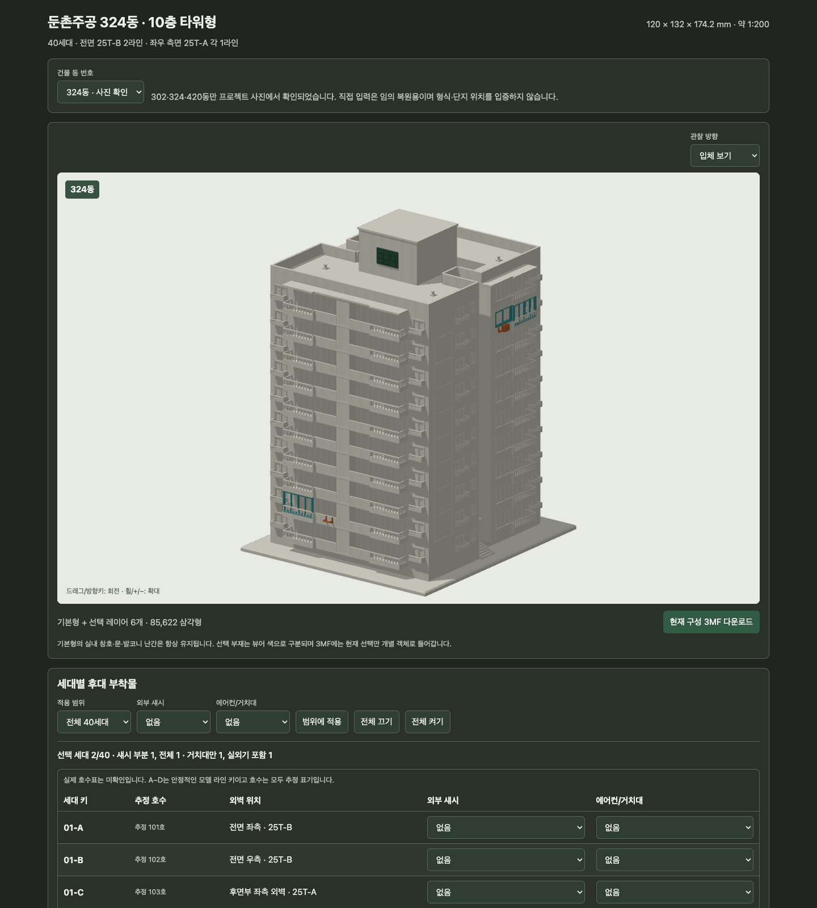
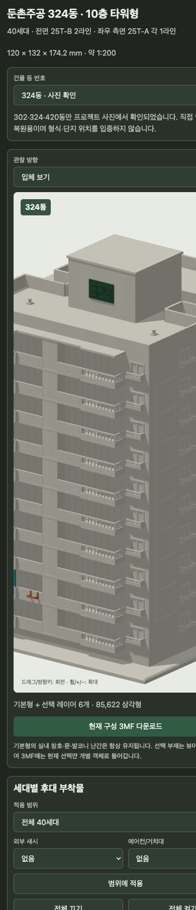

# 둔촌주공 동·세대 구성기 구현 및 검증 보고서

검증일: 2026-09-08  
대상: `jugong/`  
기준선: `origin/main`의 `9fd3e04` 이후 새 Orca 워크트리

## 1. 결과 요약

- 사진에서 확인된 타워형 후보 302·324·420동 드롭다운과 직접 입력을 제공한다. 직접 입력은 NFKC 정규화 뒤 최대 8자의 ASCII 숫자 및 내부 하이픈 하나만 허용한다.
- 동 번호는 문서 제목, 화면 표지, 옥상 코어의 돌출 3D 명판, URL, JSON, 현재 구성 3MF의 파일명·Title·구성 메타데이터에 반영된다.
- 10층 × 4라인의 40세대를 `01-A`~`10-D`로 식별한다. 실제 호수표는 확보하지 못했으므로 화면의 101~1004호는 모두 “추정”으로 표시한다.
- 각 세대에서 섀시 `없음/부분(거실만)/전체`와 에어컨 `없음/거치대만/실외기 포함`을 독립 선택한다. 기본값은 전부 꺼짐이며 전체·층·라인 일괄 적용을 제공한다.
- 기본 메시 1개와 세대별 4개 주소 레이어, 총 160개 레이어를 조립한다. 세대 조합을 지수적으로 미리 만들지 않는다.
- 브라우저 다운로드는 현재 기본형·동 명판·선택 레이어만 담은 3MF 조립체다. 같은 JSON을 Python 생성기에 전달하면 불리언 융합된 단일 연결 STL을 얻는다.

## 2. 근거와 불확실성

`docs/HISTORY.md`와 정림건축 25T형 평면을 기준으로 다음을 분리했다.

| 모델 라인 | 외벽 위치 | 평면형 | 저장 키 | 실제 호수 근거 |
|---|---|---|---|---|
| A | 전면 좌측, -Y | 25T-B | `층-A` | 없음, `층×100+1호`는 추정 |
| B | 전면 우측, -Y | 25T-B | `층-B` | 없음, `층×100+2호`는 추정 |
| C | 후면부 좌측 외벽, -X | 25T-A | `층-C` | 없음, `층×100+3호`는 추정 |
| D | 후면부 우측 외벽, +X | 25T-A | `층-D` | 없음, `층×100+4호`는 추정 |

302·324·420동은 프로젝트 사진에서 직접 읽히지만 같은 형식의 전체 동 목록은 공식 배치도 원문을 보지 못해 확정하지 않았다. 직접 입력한 번호는 형상이나 단지 위치를 자동으로 바꾸지 않는다. 옥상 명판 위치와 실외기 세부 형상은 구성 확인용 추정이다.

## 3. 구성 구조

- `src/jugong_10f_model.py`
  - `LINE_INFO`와 층 우선 순서로 40개 키를 안정적으로 생성한다.
  - 각 세대에 `sash_partial`, `sash_full`, `ac_bracket`, `ac_unit` 레이어를 생성한다.
  - 전체 섀시는 부분 레이어와 추가 전체 레이어의 합이며, 실외기 포함은 거치대와 실외기 레이어의 합이다.
  - `normalize_configuration()`은 버전, 정확한 40개 키, 열거형 상태, 동 번호를 검증한다.
  - `--configuration`은 선택 레이어와 동 명판을 기본형에 융합해 연결 STL을 출력한다.
- `scripts/build_viewer.py`
  - 세대 주소 레이어를 각각 gzip/base64로 압축하고 SHA-256·원본 크기·원시 솔리드 수와 함께 HTML에 넣는다.
- `viewer/viewer_template.html`
  - 필요한 레이어만 풀어 WebGL2 버퍼에 조립하고 기본형/섀시/에어컨/명판을 색으로 구분한다.
  - URL은 40자리 상태 문자열 두 개와 안전한 동 번호를 사용한다.
  - JSON 가져오기에서 40개 키와 상태를 다시 검증한다.
  - 3MF는 기본 메시, 선택 레이어, 명판, 최상위 조립 객체만 쓴다. 구성 JSON을 메타데이터로 XML escape한다.

원래 실내 창호와 난간은 기본 메시 생성 경로에 그대로 있고 세대 레이어 토글과 분리되어 있다.

## 4. 정적·기하 검증

실행 명령:

```sh
python src/jugong_10f_model.py --all-variants --output dist/jugong_10f.stl
python scripts/build_viewer.py
node --check /tmp/jugong-viewer-check.js
python scripts/verify.py
python tools/verify_configurator.py
```

결과:

- 세대 40개, 주소 레이어 160개, 레이어 삼각형 합 41,230개.
- 모든 내장 레이어의 gzip 해제 바이트와 SHA-256 일치.
- 층별 Z 범위와 A/B=-Y, C=-X, D=+X 외벽 경계 검증 통과.
- 기본형은 83,780 삼각형, watertight/positive volume/일관된 winding/1 connected body.
- 대표 융합 구성 모두 watertight 및 1 connected body:
  - 기본 전부 꺼짐: 83,780 삼각형
  - `05-B` 단일 세대 전체 섀시+실외기: 85,310 삼각형
  - `02-A` 부분 섀시+거치대와 `09-D` 전체 섀시+실외기: 86,186 삼각형
  - 7층 4세대 부분 섀시: 86,344 삼각형
- 동 번호 수용: `302`, 전각 `４２０동`→`420`, `123-1`.
- 동 번호 거부: `../302`, `<script>`, 9자 값, 앞/뒤 하이픈.

상세 기계 판독 결과는 `validation/configurator_validation.json`과 `validation/handoff_checks.json`에 있다.

## 5. 브라우저 동작 검증

Orca 내장 브라우저의 실제 WebGL2 페이지에서 확인했다.

- 최초 상태: 동 미지정, 활성 세대 0/40, 선택 레이어 0, 기본 83,780 삼각형.
- 전체 켜기: 40/40 세대가 전체 섀시+실외기, 선택 레이어 160개, URL의 두 상태 문자열이 모두 `2`로 보존됨.
- URL 새로고침: 위 전체 켜기 상태와 302동이 그대로 복원됨.
- 임의 혼합: `02-A=부분/거치대`, `09-D=전체/실외기`에서 활성 세대 2개, 선택 레이어 6개.
- 층/라인 중첩: 7층을 부분 섀시로 적용한 뒤 D라인을 전체+실외기로 적용해 활성 13세대, 부분 3, 전체 10, 실외기 10, 선택 레이어 43개를 확인.
- 직접 입력 공격 문자열은 이전 유효 동 324를 보존하고 오류를 표시했다. 전각 `４１９동`은 419로 정규화되어 제목·표지·URL에 반영됐다.
- 전면, 후면, 좌측, 우측, 위, 입체 방향 선택을 모두 확인했다.
- 실제 마우스 드래그로 yaw `-0.85→-1.55`, pitch `0.34→0.58`; 휠로 span `202.5→228.318` 변화를 확인했다.
- 캔버스 포커스와 방향키/`+` 키 핸들러를 표준 DOM 키 이벤트로 확인했다. Orca의 `keypress` 합성은 이번 페이지에 DOM keydown을 전달하지 않아 이 한계도 기록한다.
- 브라우저 콘솔 오류 없음.

## 6. 실제 3MF 다운로드 검증

혼합 구성 `324동, 02-A=부분/거치대, 09-D=전체/실외기`를 실제 다운로드했다.

- 파일명: `dunchon-jugong-324dong-current.3mf`
- MIME: `model/3mf`, 크기 5,338,966 bytes.
- ZIP CRC 검사 통과, `[Content_Types].xml`, `_rels/.rels`, `3D/3dmodel.model` 존재.
- 모델 XML 파싱 통과.
- 메시 객체 8개와 조립 객체 1개: base, 02-A 2레이어, 09-D 4레이어, 324동 명판, assembly.
- assembly component 8개로 미선택 세대 레이어가 들어가지 않음을 확인.
- Title은 `둔촌주공 324동 세대 구성`.
- 구성 메타데이터를 JSON으로 다시 읽어 선택 세대가 정확히 02-A와 09-D뿐임을 확인.
- 동일 소스 레이어를 Python에서 불리언 융합한 대표 구성은 watertight·단일 연결체이므로 조립체를 융합 출력하는 경로도 검증됐다.

## 7. 모바일·접근성

- 390px CSS 뷰포트 캡처에서 동 선택, 방향 선택, 캔버스, 3MF 버튼을 한 열로 배치했다.
- 일괄 적용은 범위 한 줄, 두 상태 열, 전체 폭 적용 버튼과 두 개의 전체 버튼으로 줄바꿈한다.
- 데스크톱 표는 스크롤 영역·고정 헤더, 700px 이하에서는 각 세대를 2열 카드로 바꾼다.
- 40행, 개별 상태 select 80개를 접근성 트리에서 확인했다. 각 select는 세대 키·추정 호수·상태 종류를 이름에 포함한다.
- 모든 입력은 native input/select/button이며 캔버스와 JSON 가져오기 라벨은 키보드 포커스 가능하고 `:focus-visible` 윤곽이 있다.
- 상태와 선택 집계는 `aria-live`, 동 입력 오류는 `role=alert`이다.

캡처:

- `captures/desktop-mixed.png`: 데스크톱 혼합 구성과 표.
- `captures/mobile-mixed.png`: 모바일 뷰어와 일괄 제어.





Orca 내장 브라우저의 screenshot 명령은 탭 비가시성으로 타임아웃했고 Orca Computer Use는 OS Accessibility 권한이 없어 사용할 수 없었다. 기능 검증은 내장 브라우저에서 계속 수행했고, 캡처만 로컬 Chrome headless의 WebGL SwiftShader로 생성했다.

## 8. 기존 네 STL 호환 정책

| 파일 | 정책 | 삼각형 | 연결성 |
|---|---|---:|---|
| `jugong_10f.stl` | 전부 꺼짐 | 83,780 | 1 body |
| `jugong_10f_sashes.stl` | 40세대 전체 섀시 | 125,062 | 1 body |
| `jugong_10f_ac_brackets.stl` | 40세대 빈 거치대 | 91,358 | 1 body |
| `jugong_10f_sashes_ac_brackets.stl` | 40세대 전체 섀시+빈 거치대 | 135,374 | 1 body |

파일명과 기본형 의미는 유지한다. 과거 거치대 STL은 일부 예시 층만 포함했지만 세대 스키마 도입 뒤에는 파일명 의미를 명확히 하기 위해 전 40세대 일괄 프리셋으로 확장했다. 세대별 실외기 포함 상태는 기존 파일명에 새 의미를 덧씌우지 않고 현재 구성 3MF/JSON 경로에서만 제공한다.

## 9. 배포

- 기능 커밋 `748a7fe` (`둔촌주공 동별 세대 구성기 추가`)을 `main`에 fast-forward 통합하고 `origin/main`에 push했다.
- GitHub Pages `pages build and deployment` 실행 `34238711248`이 성공했다.
- 공개 URL `https://lqez.github.io/sandbox-games/jugong/dist/dunchon_jugong_viewer.html`에서 HTTP 200, 새 제목, 동 선택기, 현재 구성 3MF 버튼을 확인했다.
- 공개 WebGL 페이지를 324동·전 세대 꺼짐 URL로 직접 열어 40세대 복원, 선택 레이어 0, 다운로드 활성 상태와 콘솔 오류 없음을 재확인했다. 동 명판 때문에 표시 삼각형은 base 83,780개에 `324` 명판 180개가 더해진 83,960개다.
