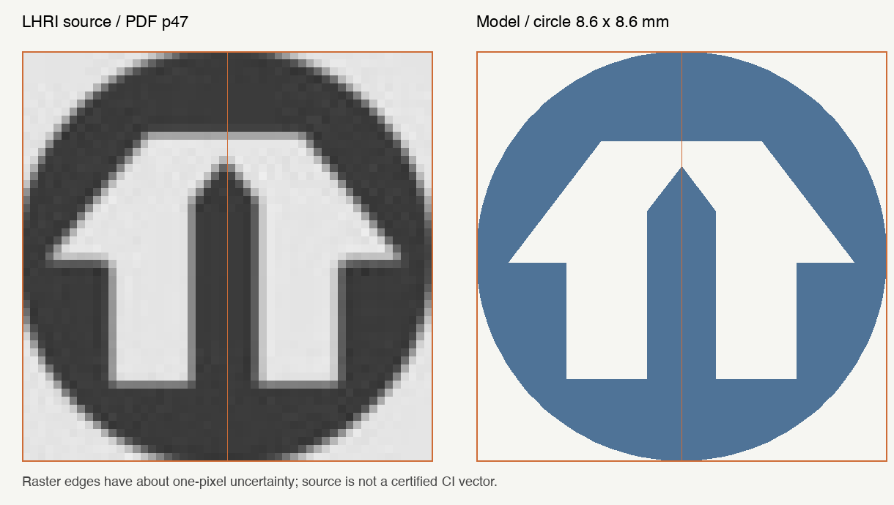

# 옛 주공 심벌·단색 양각·입체 전개·세대 선택 보정

2026-09-10. 앞선 사진별 창호/실외기 분류와 얇은 섀시·유리 작업에 이어 사용자가 직접 요청한 수정이다. 기존 다섯 사진 관찰표와 변형별 근거는 [입면 보고서](../facade-mark-window-ac-variants/REPORT.md), 프레임 치수·숫자 윤곽은 [직전 보고서](../sash-glass-sign-proportions/REPORT.md)에 보존되어 있다.

## 이번 사용자 원문

> 옛날 주공 마크를 인터넷에서 찾아서 정확하게 비율을 맞춰. 그리고 모노톤 인쇄 모드 추가해서 단일 컬러로 하게 되면 글씨와 주공 마크는 양각으로 해.
> 그리고 평면으로 펼칠때 그걸 납작하게 만들라는게 아니야. 베란다 섀시 창문 모두 입체를 유지해야지. 단지 최소한으로 접어서 재현할 수 있게끔 해달라는 얘기야.

> 그리고 호 선택할때 사격형으로 하지 말고 입체 큐브 반투명으로 선택하게 해줘 정확하게 그 호를 따라 생기도록

> 아니야 계속해서 해 근데

앞선 “전체적으로 섀시 두께를 현실감있게 줄이고 유리 매터리얼을 넣어서 섀시가 설치된 경우에는 안이 덜 보이도록”, “주공 마크와 동 숫자…폭도 제대로” 조건을 유지했다.

## 인터넷 원문과 비례

| 원문 | 관찰 | 구현 |
|---|---|---|
| LH 토지주택연구원 《공공임대주택 브랜드 적용방안 연구》 연구기획 2023-099, 인쇄 29쪽/PDF 47쪽 | `주공아파트` 음화 심벌은 원형 외곽, 흰 집, 수평 지붕마루, 뾰족한 문머리 | 외곽 8.6 × 8.6 mm, 밝은 바탕 10.6 × 10.6 mm; 원에서 집 윤곽을 뺀 벡터 단면 |
| 대한주택공사 《HOUSING STATUS 1981》 표지 | 원형 테두리와 집을 인쇄한 양화 버전 | 원형 및 수평 마루 교차 확인; 음화/양화 차이를 구분 |

[첫 번째 원문](https://www.codil.or.kr/filebank/original/RK/OTKCRK240295/OTKCRK240295.pdf), [1981년 원문](https://www.codil.or.kr/filebank/original/EC/OTKNEC000981/OTKNEC000981.pdf). 추출 이미지와 출처는 [references/knhc-logo](../../../references/knhc-logo/SOURCES.md)에 있다. 마크 원본 래스터는 69 × 60 px이고 어두운 잉크의 임계값 경계는 52 × 51 px다. 인쇄/래스터 오차를 고려해 실제 원형 비율을 1:1로 고정했다. 인증된 CI 제도용 SVG를 확보한 것은 아니며 세부 윤곽에는 약 1–2 px의 측정 한계가 있다.

마크는 기존의 상층 빈 측벽 위치, 동 숫자는 같은 우측 측벽 저층 영역을 유지한다. 숫자는 직전 사진 기반 윤곽을 재사용하며 `324`의 글자 몸체 폭은 8.321 mm, 높이는 5.3 mm다. 임의 옥상 명판을 추가하지 않았다.

## 구현 결과

- **모노톤:** `인쇄 색상`에서 단색 선택과 필라멘트 색 변경. 단색은 3MF 재료 하나 및 모든 면의 인덱스 0만 사용한다. 마크와 동 번호는 0.65 mm 양각, 컬러 모드는 기존 0.025 mm 도장과 네 슬롯을 유지한다. JSON `printMode/monoColor`, URL, Python `--monochrome`, 완성형·전개형 내보내기에 동일하게 적용한다. 단색 표면 미리보기는 불투명 재료와 음영을 사용한다.
- **입체 전개:** 기존 4개 직사각형의 얕은 대체 부조를 제거했다. 실제 H형 외곽의 12개 벽 평면에 원래 부재를 배정하고 강체 회전·이동으로 펼친다. 창틀·유리·발코니·차양·실외기의 깊이와 부피를 줄이지 않는다. 외벽 방향이 바뀌는 11곳에만 연결부가 있고 마지막 이음은 열려 있다.
- **전개 치수:** 면 폭은 `103, 44, 23, 12, 15.5, 51.5, 88, 51.5, 15.5, 12, 23, 44 mm`. 1.6 mm 간격을 포함한 스트립은 **500.6 × 153.48 × 26.9 mm**다. 벽 2.2 mm, 연결막 0.45 mm. 옥상 설비를 보존한 삽입식 지붕은 **98.2 × 102.7 × 25.8 mm**, 바닥은 **120 × 132 × 2.75 mm**이며 H형 내부 외곽을 따르는 위치결정 테두리가 있다.
- **세대 선택:** 몸체와 돌출 발코니/작은방 창 범위를 포함하는 반투명 3D 셀, 입체 모서리, 깊이 가림을 사용한다. 공용 계단 코어를 제외하며 회전과 전개에 따라 움직인다. 기존 2D 직사각형 DOM을 제거했다. 선택 도형은 STL/3MF에 들어가지 않는다.
- **기존 조건:** 40세대 초기 옵션 OFF, seed별 사진 빈도 가중치, 직접 지정 우선, 얇은 프레임과 유리, 동 번호 입력, 세대·층·라인 일괄 설정을 유지한다. 음영 맵 좌표와 실제 투영 범위가 달랐던 부분을 함께 맞췄다.

## 검증

| 검사 | 결과 |
|---|---|
| `--all-variants` 모델 생성 | 기존 STL 4종, 4색 3MF, 1,000개 주소 레이어와 전개 레이어, 지붕·바닥 갱신 |
| `scripts/verify.py` | 네 기본 STL 및 내장 메시 해시, 40세대 매핑, 재료 참조 통과 |
| `tools/verify_configurator.py` | 기본·한 세대·다른 층/라인·층 일괄 네 대표 융합 STL 모두 양의 부피/닫힘/단일 연결체 |
| `tools/verify_facade_variants.py` | seed 0/324/20260910 및 모든 variant 순환 구성, 완성형·전개형 융합 STL 통과 |
| `tools/verify_sash_glass.py` | 유리 포함 완성형/전개형 880개 레이어와 프레임 색 분리 통과 |
| `tools/verify_volume_unfold.py` | 선택 부재 **16,464개** 부피 보존 및 역변환 검사; 최대 역변환 경계 오차 **0.00000733 mm**, 원래 부착물 부피 오차 **5.46e-12 mm³** |
| `tools/verify_print_kit.py` | 실제 스트립 치수/입체 깊이, 지붕·바닥 닫힘·양의 부피·단일 연결체 통과 |
| 단색 Python STL/3MF | seed 324 완성형·전개형 모두 단일 연결체, 재료 슬롯 1, 삼각형 참조 0 |
| 실제 Orca 브라우저 회귀 | 세 seed 재현 및 Python 동일성, 모든 변형 다양성, 직접 지정 유지, URL/JSON, 동 번호 입력 검증, 실제 포인터 `05-B` 호버·클릭 및 작은방 선택, 390 px 모바일 넘침 없음 |
| 실제 브라우저 단색 | native select, 단색 색상·URL 복원, 입체 선택·전개 상태 보존, 컬러 복귀 통과 |
| 실제 브라우저 다운로드 | 완성형/전개형 컬러 두 3MF는 4슬롯, 단색 두 3MF는 1슬롯; ZIP/면 참조/닫힘 검사 통과 |
| JS 구문 / Git | `node --check`, `git diff --check` 통과 |

기계 판독 결과: [강체/단색](validation/volume-validation.json), [seed/변형](validation/variant-validation.json), [브라우저 회귀](browser-regression/browser-validation.json), [단색 브라우저](captures/browser-mono-validation.json), [브라우저 단색 패키지](validation/browser-mono-packages.json). 반복 생성 가능한 검사 STL/3MF는 로컬 결과로 유지하고 Git에는 캡처·JSON·로그·재생성 도구를 기록한다.

## 비교와 캡처

`comparison`은 동일 seed 324, 1280 × 1000 viewport, 같은 카메라 좌표의 변경 전/후 캡처다. [카메라 값](comparison/comparison-camera.json).

| 대상 | 이전 | 수정 |
|---|---|---|
| 건물 | [이전](comparison/before-folded.png) | [수정](comparison/after-folded.png) |
| 주공 마크 | [이전 타원](comparison/before-mark.png) | [수정 원형](comparison/after-mark.png) |
| 전개 | [이전 얕은 4면](comparison/before-unfolded.png) | [수정 입체 12면](comparison/after-unfolded.png) |

[마크 단색 양각](captures/mark-mono-emboss.png), [동 번호 단색 양각](captures/number-mono-emboss.png), [반투명 입체 선택](captures/selection-volume.png), [전개 창호 깊이](captures/unfolded-window-depth.png), [전개 단색 깊이](captures/unfolded-mono-depth-selection.png). 모든 창호/작은방/실외기 variant와 모바일 캡처는 `browser-regression`에 있다. 배포용 STL 미리보기도 갱신했다.

## 변경 파일과 배포

핵심 코드는 `src/facade_signs.py`, 새 `src/facade_unfold.py`, `src/jugong_10f_model.py`, `viewer/viewer_template.html`, `scripts/build_viewer.py`다. 검사/분석/캡처 도구는 `tools`에 두었으며 `dist`, `validation`, `README`, `CONTINUE`, `AGENTS`, `SHA256SUMS.txt`를 함께 갱신한다. `.DS_Store`와 다른 작업 파일은 포함하지 않는다.

커밋·push·Pages 확인은 아래에 최종 기록한다.

## 남은 한계

- 실제 프린트와 접힘 시험은 수행하지 않았다. 강체 변환의 형상 보존 검사가 연결막의 재료별 내구성·접힘 반경·모서리 간섭·최종 조립 공차까지 보증하지 않는다. 지붕·바닥 결합과 열린 마지막 이음은 실물 쿠폰으로 확인해야 한다.
- 500.6 mm 스트립은 일반 220–256 mm 베드에 들어가지 않으며 입체 부재에는 서포트 계획이 필요하다. 0.16 mm 창짝과 0.12 mm 유리판은 장비/축척별 출력 한계가 있다.
- 내부 평면에 근거한 세대 범위를 표시하지만 실제 동별 호수 대응은 기존과 같이 추정이다. 지붕 설비의 세부 치수 및 사진에서 확인되지 않는 정보도 추정으로 남는다.
